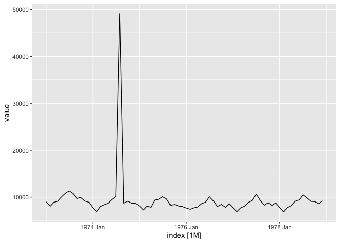
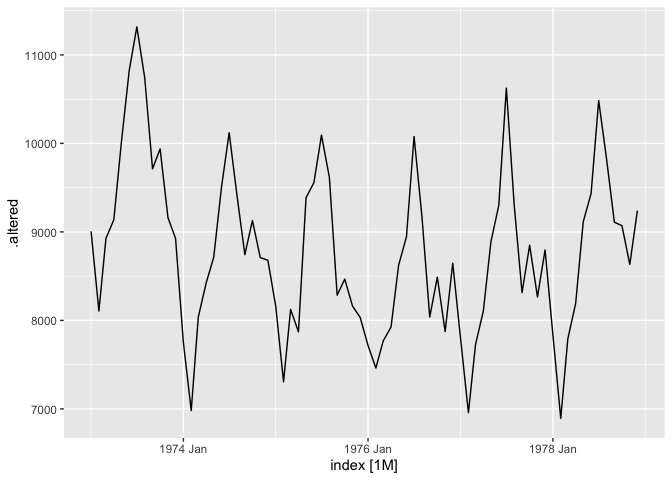

<!-- README.md is generated from README.Rmd. Please edit that file -->

# outstable

<!-- badges: start -->
<!-- badges: end -->

The goal of `outstable` is to provide a framework for detecting
anomalies in tidy time series data. An anomaly is defined as an
observation that is predicted as very unlikely given the robust time
series forecast models. The algorithm works with tidy temporal data
provided by the [`tsibble`](https://tsibble.tidyverts.org/) package and
produces an outstable, a tsibble with flagged anomalies and their degree
of outlierness. An approach based on extreme value theory is applied to
residual series in order to calculate a data-driven anomalous threshold.
The proposed framework can also provide a cleansed tsibble that closely
integrates with the tidy forecasting workflow used in the
[`fable`](https://fable.tidyverts.org/) package. A number of different
approaches are available for the data cleansing process.

## Installation

<!--
You can install the released version of outstable fro
m [CRAN](https://CRAN.R-project.org) with:

``` r
install.packages("outstable")
```
-->

And the development version from [GitHub](https://github.com/) with:

``` r
# install.packages("devtools")
devtools::install_github("pridiltal/outstable")
```

## Example

This is a basic example which shows you how to solve a common problem:

``` r
library(fabletools)
data <- USAccDeaths
# Convert 20th data point as an outlier
data[20] <- data[20]*5

data %>%
  tsibble::as_tsibble() %>%
  fabletools::autoplot(value)
```



``` r
p <- data %>%
  tsibble::as_tsibble() %>%
  outstable::detect_outliers(
    variable = "value",
    cmbn_model = c("arima", "theta",
                   "ave"),
    p_rate = 0.001)

altered_data <- p %>% 
  outstable::cleanse_data(
    variable = "value",
    impute = "spline")

altered_data %>%
  fabletools::autoplot(.altered)
```


